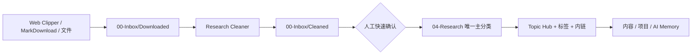

# Research Collection Workflow

```mermaid
flowchart LR
  A[Web Clipper / MarkDownload / 文件] --> B[00-Inbox/Downloaded]
  B --> C[Research Cleaner]
  C --> D[00-Inbox/Cleaned]
  D --> E{人工快速确认}
  E --> F[04-Research 唯一主分类]
  F --> G[Topic Hub + 标签 + 内链]
  G --> H[内容 / 项目 / AI Memory]
```

## 每日

- 收集后运行 Cleaner。
- 清空 `Cleaned` 中已经确认的项目。

## 每周

- 运行 Knowledge Base Audit。
- 检查 [[04-Research/Topic Hubs/Topic Index]] 的孤立主题和未链接资料。

