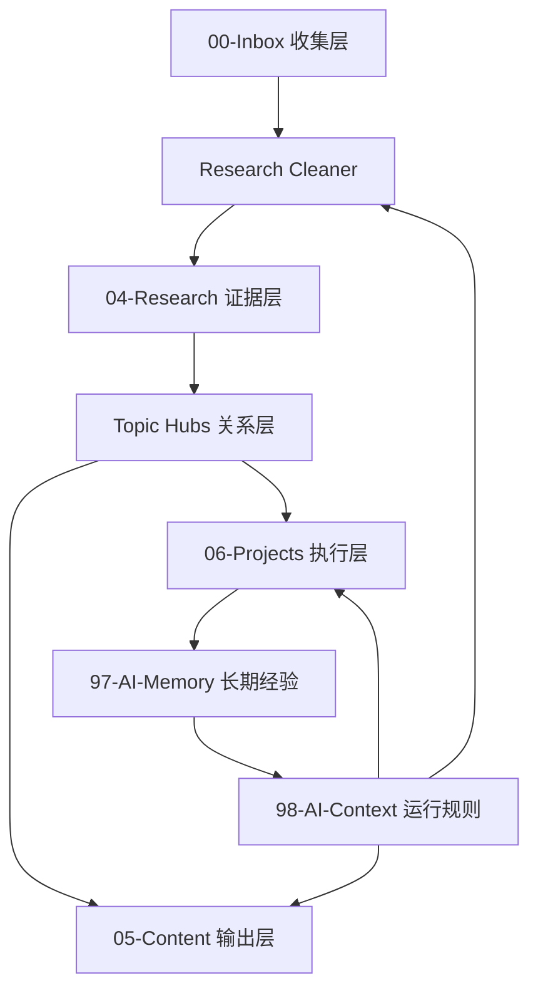

# Knowledge Map

```mermaid
flowchart TD
  Inbox[00-Inbox 收集层] --> Cleaner[Research Cleaner]
  Cleaner --> Research[04-Research 证据层]
  Research --> Topics[Topic Hubs 关系层]
  Topics --> Content[05-Content 输出层]
  Topics --> Projects[06-Projects 执行层]
  Projects --> Memory[97-AI-Memory 长期经验]
  Context[98-AI-Context 运行规则] --> Cleaner
  Context --> Content
  Context --> Projects
  Memory --> Context
```

研究主轴：世界 → 产业 → 企业 → 金融；AI 是效率与价值工具；“人”解释决策；“个人”沉淀独有资产；“每日更新”提供变化信号。

